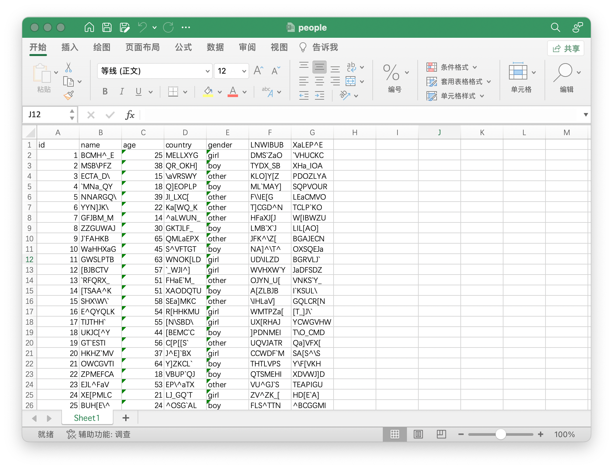

# xlsx-reader

是一个xlsx解析器，与poi不同的是xlsx-reader只支持row-by-row的方式读取文件中的每行数据，由于不需要将整个DOM树载入到内存，xlsx-reader具有更小的内存占用。

xlsx-reader适用于以较小的内存占用从xlsx格式的文件中读入java对象的场景，如果你用poi读入excel出现了OutOfMemoryError那么这个库很可能可以解决你的问题，具体的使用请见示例。

## 快速开始

如果是maven项目，先引入依赖

```xml
<dependency>
  <groupId>io.github.walterinkitchen</groupId>
  <artifactId>mini-xlsx-reader</artifactId>
  <version>1.0.3</version>
</dependency>
```

我们希望从下面的xlsx文件中读出所有的people对象。



定义一个我们要从xlsx中读出的类；

```java
@Data
@Sheet
public class People {
    @Column(name = "id")       //映射到id列
    private String id;

    @Column(name = "name")	   //映射到name列
    private String name;

    @Column(name = "country")	 //映射到country列
    private String country;

    @Column(name = "gender")	 //映射到gender列
    private String gender;
}
```

提供一个xlsx文件，一个期望解析的class就可用迭代器解析出实例

```java
public static void main(String[] args) throws URISyntaxException {
  File file = openFile("people.xlsx");
  try (EntityIterator<People> iterator = EntityIteratorFactory.buildXlsxEntityIterator(file, People.class)) {
    int counter = 0;
    StopWatch stopWatch = StopWatch.create();
    stopWatch.start();
    while (iterator.hasNext()) {
      People next = iterator.next();
      System.out.println(next);
      counter++;
    }
    long total = Runtime.getRuntime().totalMemory() / (1024 * 1024);
    long max = Runtime.getRuntime().maxMemory() / (1024 * 1024);
    stopWatch.stop();
    System.out.println("timeUsed:" + stopWatch.getTime(TimeUnit.SECONDS) + " seconds");
    System.out.println("counter:" + counter);
    System.out.println("total:" + total + "MB max:" + max + "MB");
  } catch (Exception e) {
    throw new RuntimeException(e);
  }
}

private static File openFile(String srcFile) throws URISyntaxException {
  URL resource = MiniReader.class.getClassLoader().getResource("people.xlsx");
  return new File(resource.toURI());
}
```

在主机内存16G的笔记本上，100+万条记录使用内存256MB，耗时14s（不同的机器在不同的时间运行得到的结果不同）

```shell
timeUsed:14 seconds
counter:1048575
total:256MB max:4096MB
```


